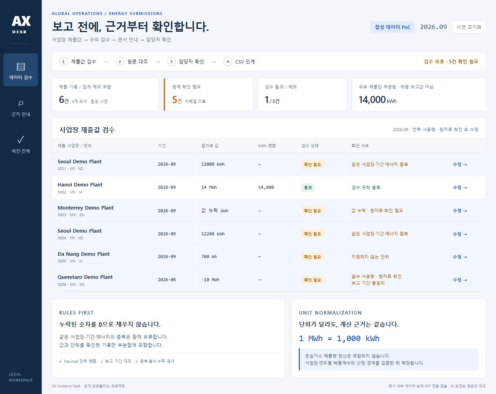
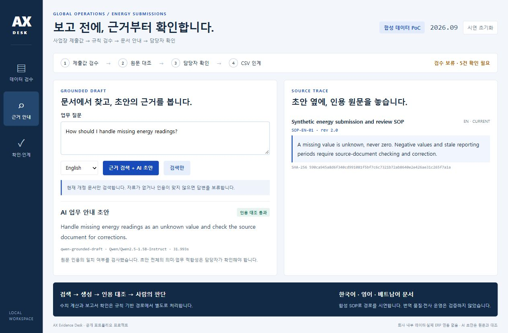
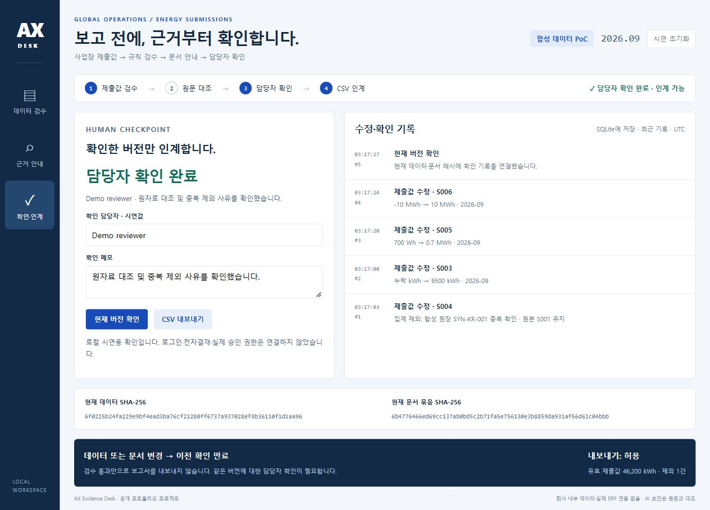

# AX Evidence Desk

**해외 사업장 제출값을 검수하고, 현행 문서에 근거한 AI 초안을 대조한 뒤, 담당자가 확인한 버전만 인계하는 개인 PoC입니다.**



도루코의 공개 AI 업무혁신 공고와 글로벌 시스템·ESG 데이터 통합 사례에서 문제를 골랐습니다. 이 프로젝트는 도루코의 내부 시스템, 사내 정책, 구축 실적, 제휴 결과물이 아닙니다. 모든 제출값·원자료·SOP는 **합성 시연 데이터**입니다. 회사 문서는 설계 배경 링크로만 사용하며 검색 코퍼스에 복제하지 않았습니다.

## 무엇을 만들었나

1. **데이터 검수:** 6개 제출 기록의 누락·음수·기간·단위·중복을 검사합니다. 같은 사업장·기간·에너지의 중복 기록은 모두 보류하고, 사유를 남긴 제외 후에만 원본 기록을 집계합니다.
2. **원자료 대조:** 수정 창에 합성 원장 ID·기간·원래 값·단위를 같이 보여 줍니다. 누락을 자동으로 0으로 채우지 않습니다. 서버 규칙이 원장과의 의미상 일치를 승인하지는 않으며 담당자가 직접 대조합니다.
3. **문서 근거 안내:** 한국어·영어·베트남어 현행 SOP의 문단을 어휘 일치로 검색합니다. 구버전 문서는 제외합니다. 검색만 실행하면 모델을 사용하지 않은 원문 발췌라고 표시합니다.
4. **실제 로컬 LLM:** 선택 기능으로 Qwen2.5-1.5B-Instruct를 CPU에서 실행해 검색 근거 기반 초안을 생성합니다. JSON 형식과 문서 ID·인용문 일치를 검사합니다. 오류는 초안 보류로 표시하고 원문을 남깁니다. 인용 일치는 초안 전체의 의미가 맞다는 증명이 아닙니다.
5. **버전 확인과 인계:** 사람이 화면에서 본 데이터·문서 해시를 제출합니다. 다른 탭의 수정이나 SOP 개정으로 버전이 달라졌으면 `409 stale_snapshot`으로 거절합니다. 검수 오류 해소와 현재 버전 확인이 모두 있어야 CSV를 내보냅니다.

## 실행

기본 앱과 28개 테스트는 Python 3.10+ 표준 라이브러리만 사용합니다.

```bash
git clone https://github.com/Kimhyuntae9665/global-ax-evidence-desk.git
cd global-ax-evidence-desk
python server.py
```

브라우저에서 `http://127.0.0.1:8765`를 엽니다. 로컬에만 바인딩합니다. 초기 시연에는 오류가 의도적으로 포함되어 있습니다. `시연 초기화`는 합성 기록을 되돌리며 감사 이력을 보존합니다.

```bash
python -m unittest discover -s tests -v
python scripts/verify_workflow.py
```

선택 모델 기능은 별도의 터미널에서 실행합니다. 약 **3.09 GB**의 모델 파일을 명시적으로 다운로드합니다. 기본 앱 실행은 모델을 자동 다운로드하지 않습니다.

```bash
python -m pip install -r requirements-model.txt
python scripts/download_model.py --destination models/qwen-1.5b
python model_server.py --model-dir models/qwen-1.5b
```

모델 서비스는 `127.0.0.1:8891`에서 실행합니다. 가중치 SHA-256을 공식 고정 리비전의 값과 대조합니다. `trust_remote_code=False`, 로컬 파일만 로드합니다. 모델이 없으면 검색 원문으로 돌아가며 화면에서 생성 실행과 검색 실행을 구분합니다. CPU 생성은 즉시 응답하지 않을 수 있습니다.

## 직접 실행해 확인한 결과

- 합성 초기 상태: 6건 중 **5건 보류**, 유효 부분합 **14,000 kWh**. 오류 7개는 보류 기록 5개와 다른 단위입니다.
- 원장 대조 후: 중복 1건 제외, 유효 5건의 합 **46,200 kWh**. 이는 합성 사례의 계산 결과이며 실제 기업의 절감량이 아닙니다.
- 오류가 남은 상태 → 수정했지만 미확인 상태 → 확인된 상태 → 수정 후 확인 만료 상태를 재현했습니다. CSV 응답은 각각 **409 → 409 → 200 → 409**였습니다.
- **28개 회귀 테스트**가 누락·Decimal 변환·큰 지수·동일 문서의 두 인용·구버전 제외·SQLite 재연결·오래된 화면의 확인 거절·HTTP 경계를 검사합니다.
- Qwen 0.5B의 실제 형식 오류를 보류했고, 프롬프트 수정 후에도 필드 누락이 남았습니다. 이를 기록한 뒤 1.5B 모델로 재검증했습니다. 모델별 원출력과 실패는 [개발 확인 기록](docs/model-evaluation/)에 남깁니다. 소수의 개발 사례이며 일반 정확도나 전사 적용 성능은 산정하지 않았습니다.

[재현 가능한 워크플로 기록](docs/workflow-evidence.json) · [로컬 테스트 로그](docs/test-run.txt) · [시연 순서](docs/demo-guide.md) · [검증 범위](docs/validation.md)

## 실제 화면





[초기 모델 실패를 보류한 화면](docs/screenshots/04-rejected-model-output.jpg)도 보존합니다. 화면은 실제 브라우저에서 캡처했으며 화면의 데이터는 합성 시연값입니다.

## 구조와 책임

```text
합성 제출 기록 ── Decimal 검수 ── 수정·제외 이력 ── 데이터 해시
                                                    │
현행 KO/EN/VI SOP ── 어휘 검색 ── Qwen 초안 ── 인용 대조
       │                                            │
     문서 해시 ─────────── 담당자 현재 버전 확인 ─────┘
                               │
                       확인 상태 검사 → CSV
```

AI는 수치 계산, 원자료 확인, 집계 제외 판단, 보고 승인 권한을 갖지 않습니다. 생성된 초안은 CSV 데이터에 자동 반영되지 않습니다. SQLite 감사 이력에는 수정 전·후와 시각을 저장합니다. 감사 저장소는 변조 방지 원장이나 인증된 결재 시스템이 아닙니다.

## 설계 배경과 출처

- [도루코 공식 AI 업무혁신 공고](https://dorco.recruiter.co.kr/career/jobs/129929): 생성형 AI PoC, 업무 자동화, 정책·보안·교육을 다루는 직무. 이 프로젝트의 과제 선정 근거입니다.
- [도루코 공식 ERP·제조시스템 공고](https://dorco.recruiter.co.kr/career/jobs/122611): SAP·D365·MES/WMS 및 인터페이스 관리. 실제 연동을 구현했다는 의미는 아닙니다.
- [이수그룹 공식 발표](https://www.isu.co.kr/kor/prcenter/news_view.jsp?sno=864), 2025-09-15: 도루코 국내외 사업장·협력사 공급망 약 700곳의 ESG 데이터 통합 플랫폼 개발 발표. 당시 개발 중이며 이 프로젝트가 운영 완료 또는 AI 적용을 증명하지 않습니다.
- [Qwen 공식 모델 카드](https://huggingface.co/Qwen/Qwen2.5-1.5B-Instruct): 모델 Apache-2.0. 고정 리비전 `989aa7980e4cf806f80c7fef2b1adb7bc71aa306`. 이 저장소 MIT 라이선스는 외부 모델의 라이선스를 대신하지 않습니다.

## 제작 방식과 한계

김현태의 공개 포트폴리오용으로 Codex 에이전트를 활용해 설계·구현·실행 검증했습니다. 코드, 테스트, 실패 기록, 실제 화면을 공개해 결과를 다시 확인할 수 있게 했습니다. 공개 커밋을 수작업 단독 코딩이나 기업 실무 운영 경험으로 해석하지 않습니다.

실제 ERP/ESG 연결, OCR·파일 업로드, 임베딩/벡터 검색, Power Automate/Copilot Studio 연동, SSO·역할별 권한·전자결재, 온실가스 배출계수, 번역 품질 평가, 의미상 인용 일치, 대규모 사용·보안 검증은 범위에 포함하지 않았습니다.
